 

## Sobre

Atuação ponta a ponta em IA generativa e backend Python: sistemas agênticos com LangGraph (ReAct, tool-calling e roteamento dinâmico de skills), RAG com busca híbrida (Qdrant + Elasticsearch, fusão RRF e reranking com cross-encoder), fine-tuning de LLMs abertos (LoRA/QLoRA em Gemma e Qwen, CPT + SFT) e microsserviços de alta disponibilidade (FastAPI) com observabilidade via OpenTelemetry.

Ambiente colaborativo por padrão: trocar ideia com o time, destravar tarefas e manter o foco na entrega. Diante de tecnologia ou problema novo, vou atrás até aprender e resolver.

 

## Stack

**Linguagens & Frameworks**

**IA Generativa & LLMs**

**Dados & Busca**

**Infra & Observabilidade**

**Ferramentas de desenvolvimento com IA**

 

## Estatísticas

  
  

 

## Competências

**IA & Dados**
`IA Generativa` · `RAG` · `LLMs locais` · `Fine-tuning de LLM (LoRA/QLoRA)` · `Bancos de dados vetoriais` · `Visão computacional` · `Processamento de Linguagem Natural (NLP)` · `Programação LLM determinística`

**Engenharia**
`Backend de alta disponibilidade` · `Microsserviços` · `API REST` · `POO` · `CI/CD` · `Docker` · `Servidores Linux (administração e arquitetura)` · `OpenTelemetry` · `Web Scraping` · `Bancos de dados relacionais` · `Object Storage (MinIO/S3)` · `Documentação de software`

**Colaboração & Atitude**
`Comunicação` · `Trabalho em equipe` · `Resolução de problemas` · `Aprendizado rápido` · `Adaptação` · `Capacidade de organização` · `Metodologias ágeis`

 

